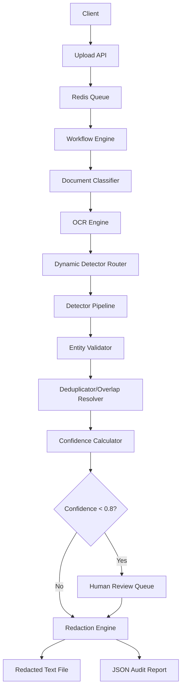

# DocShield-AI — Current PoC Technical Context

## 1. Executive Summary
DocShield-AI is a specialized PII/PHI redaction system designed for healthcare and enterprise documents. It currently implements a multi-stage pipeline that transforms uploaded documents into redacted text files with associated audit reports.

**PoC Objective**: To provide a high-precision, deterministic, and verifiable pipeline for identifying and masking sensitive health and personal information using a hybrid approach of rules, statistical models, and LLMs.

**Core Flow**:
`Upload` $\rightarrow$ `Classification` $\rightarrow$ `OCR/Extraction` $\rightarrow$ `Dynamic Detection Orchestration` $\rightarrow$ `Entity Merging/Validation` $\rightarrow$ `Confidence Scoring` $\rightarrow$ `Human Review Trigger` $\rightarrow$ `Text Redaction` $\rightarrow$ `Audit Report Generation`.

**Bulk Processing**: Uploads (single or batch) are grouped under a `Run` (UUID) that aggregates 1–N `Document`s; progress is tracked via `total_files` / `completed_files` / `failed_files` counters.

**Main Technologies**:
- **Backend**: Python (FastAPI), SQLAlchemy.
- **OCR**: PaddleOCR, PyMuPDF (fitz).
- **Detection**: Regex, Microsoft Presidio, GLiNER, MedSpaCy, Qwen3:4b (via Ollama).
- **Infrastructure**: Redis (Queue), PostgreSQL (Database), Local Storage.

**Current Maturity**: Functional PoC.
**Main Limitations**: Redaction is currently performed on extracted text files rather than original PDFs; OCR quality depends heavily on document layout; LLM detection is bounded to small contexts for performance.

---

## 2. Repository Structure
```text
api/                # FastAPI routes and Pydantic schemas
core/               # Global configuration and DB session management
database/           # SQLAlchemy models and Repository pattern implementations
docs/               # Documentation and run profiles
frontend/           # Vanilla JS/HTML/CSS dashboard
modules/            # Core logic
  classification/   # Document type classification (rules-based)
  detection/        # NER pipeline (detectors, validators, orchestrator)
  extraction/       # OCR and text extraction engines
  upload/           # File ingestion and validation
orchestration/      # Workflow engine (state machine/execution plan)
redis_queue/        # Async background worker implementation
scripts/            # Local environment and Docker utility scripts
storage/           # Local filesystem for uploads, extracted text, and redacted files
tests/              # Unit, integration, and regression tests
```

---

## 3. System Architecture
```text
User/Client (Frontend)
   ↓
API Layer (FastAPI)
   ↓
Upload Module (Validation & Storage)
   ↓
Redis Queue (Async Processing)
   ↓
Orchestration Workflow (DocumentProcessingWorkflow)
   ↓
  ├── Classification (DocumentClassificationService)
   └── Extraction (OCRDecisionEngine $\rightarrow$ PaddleOCR/Native)
           ↓
   Detection Pipeline (DetectionService)
   ├── Deterministic (Regex)
   ├── Statistical (Presidio, GLiNER)
   ├── Clinical (MedSpaCy)
   └── Semantic (Qwen3:4b)
           ↓
   Entity Post-Processing (EntityValidator $\rightarrow$ Deduplicator $\rightarrow$ Overlap Resolver)
           ↓
   Confidence/Risk Scoring (ConfidenceCalculator)
           ↓
   Human Review Trigger (Review Repository)
           ↓
   Redaction Engine (Text replacement)
           ↓
   Final Output (Redacted .txt + JSON Audit Report)
```

---

## 4. End-to-End Execution Flow

| Stage | Actual implementation | Important files/functions | Input | Output |
| :--- | :--- | :--- | :--- | :--- |
| **Upload** | Validation, storage & `Run` creation | `modules/upload/service.py` | File(s) | `Run` + `Document` records |
| **Classification** | Rules-based weighted signals | `modules/classification/service.py` | Filename/Text | `DocumentType` |
| **OCR Decision** | Extension/content-type check | `modules/extraction/ocr.py` | File | `OCREngine` selection |
| **Extraction** | Native/PaddleOCR extraction | `modules/extraction/paddle.py` | File | `extracted_text` |
| **Orchestration** | Dynamic route selection | `modules/detection/service.py` | Text + Type | Detector sequence |
| **Detection** | Sequential detector execution | `modules/detection/detectors/*.py` | Text | `DetectionResult` list |
| **Validation** | Contextual filtering/reclass | `modules/detection/validators/entity_validator.py` | Candidates | Validated Entities |
| **Merging** | Deduplication & overlap resolution | `modules/detection/deduplicator.py` | Entities | Resolved Entities |
| **Scoring** | Detector-specific calibration | `modules/detection/confidence.py` | Resolved Entities | Final Confidence |
| **Redaction** | Text span replacement | `orchestration/workflow.py` | Text + Entities | `.txt` redacted file |
| **Reporting** | JSON summary generation | `orchestration/workflow.py` | Processing State | `.json` audit report |

---

## 5. Run & Document Tracking
- **Run**: A bulk-upload unit. One upload request (single or batch) creates exactly one `Run` (max 100 files) that aggregates 1–N `Document`s.
- **Models** (`database/models/`):
  - `Run` (table `runs`): `id` (UUID PK), `run_id` (unique, e.g. `RUN-000001`), `status` (`QUEUED` → `COMPLETED`/`FAILED`), counters `total_files` / `completed_files` / `failed_files`, timestamps.
  - `RunSequence` (table `run_sequence`): single-row `last_value` counter used to generate sequential `RUN-xxxxxx` IDs atomically.
  - `Document` (table `documents`): gained `run_id` FK → `runs.id` (indexed, nullable).
- **Run lifecycle** (`database/repositories/run_repository.py` → `RunRepository`):
  - `create_run()` increments `run_sequence` (`with_for_update()`) and generates `RUN-{n:06d}`.
  - `increment_completed()` / `increment_failed()` auto-set terminal status when `completed_files + failed_files == total_files`.
- **API**: `POST /upload/` (single → `run_id` + `document_id`), `POST /upload/bulk` (multi-file → `run_id`, `total_files`, `documents[]`), `GET /documents/runs/{run_id}` (progress + per-document status).
- **Storage**: Each document is stored under `{STORAGE_DIR}/runs/{run_id}/documents/{document_id}/` → `original/`, `extracted/`, `redacted/`, `report.json` (`modules/upload/storage.py`).

## 6. Document Processing & OCR
- **Supported Types**: PDF, PNG, JPG, JPEG, TIFF, BMP, TXT, DOCX.
- **OCR Engines** (`OCREngine` in `modules/extraction/ocr.py`):
  - **NATIVE_PDF**: PyMuPDF (for fully searchable PDFs).
  - **NATIVE_TEXT**: For `.txt` / `.docx` (no OCR).
  - **PADDLEOCR**: Used for scanned images/PDFs (via `modules/extraction/paddle.py`).
  - **MIXED_PDF**: Combination of native + OCR for hybrid documents.
- **Routing** (`OCRDecisionEngine`): Per-document decision from per-page searchability. Heuristics in `_inspect_pdf_page`:
  - `SUBSTANTIAL_TEXT_THRESHOLD = 500`: page text ≥ 500 chars → searchable regardless of images.
  - `MIN_SEARCHABLE_TEXT_LENGTH = 10`: text ≥ 10 chars but < 500 → searchable unless dominated by images.
  - `MAX_IMAGE_AREA_RATIO = 0.30`: if the **union** of all image rect areas (clipped to page) exceeds 30% of page area, the page is treated as scanned (multi-image safe).
  - All searchable → `NATIVE_PDF`; none → `PADDLEOCR`; mixed → `MIXED_PDF`; images → `PADDLEOCR`; text/word → `NATIVE_TEXT`.
- **Page attribution**: Native extraction joins pages with `\n\n\f\n\n` (form-feed separator) so page numbers stay correct.
- **Verified fixes**: Scanned body + short searchable footer now routes to `PADDLEOCR` (previously misrouted to `NATIVE_PDF`); overlapping multi-image pages are no longer misclassified.
- **Limitations**: No OCR preprocessing (denoising/deskewing) found; output is currently plain text.

---

## 7. PII/PHI Detection Pipeline

| Detector | Technology | Entities | Input | Output | Trigger | Confidence | Fallback | Used? |
| :--- | :--- | :--- | :--- | :--- | :--- | :--- | :--- | :--- |
| **Regex** | Python `re` | High-risk IDs, Email, Phone | Text | `DetectionResult` | Always | 0.4-1.0 | N/A | Yes |
| **Presidio** | MS Presidio | Person, Location, Org | Text | `DetectionResult` | Domain Route | Statistical | N/A | Yes |
| **GLiNER** | GLiNER Model | Healthcare roles, Facilities | Text | `DetectionResult` | Domain Route | Model score | N/A | Yes |
| **MedSpaCy** | MedSpaCy | Symptoms, Lab, Medication | Text | `DetectionResult` | Healthcare Domain | 0.95 (Capped) | N/A | Yes |
| **Qwen3:4b** | Ollama / Qwen | Semantic PII/PHI | Bounded Context | `DetectionResult` | Unresolved Spans | Model score | N/A | Yes |

**Qwen Orchestration**: Runs on "bounded contexts" (80 chars around unresolved candidates or low-confidence entities), limited to max 3 contexts per page to optimize latency.

---

## 8. Entity Taxonomy

### PII
- `PERSON`, `EMAIL`, `PHONE_NUMBER`, `US_PHONE_NUMBER`, `ADDRESS`, `DATE_OF_BIRTH`, `SSN`, `PASSPORT_NUMBER`, `AADHAAR_NUMBER`, `PAN_NUMBER`, `DRIVING_LICENSE`, `ZIP_CODE`, `PIN_CODE`.

### PHI
- `PATIENT`, `DOCTOR`, `PROVIDER`, `HOSPITAL`, `MEDICAL_RECORD_NUMBER` (MRN), `INSURANCE_ID`, `POLICY_NUMBER`, `CLAIM_NUMBER`, `MEMBER_ID`, `GROUP_NUMBER`, `EOB_NUMBER`, `NPI_NUMBER`, `DIAGNOSIS`, `MEDICATION`, `PROCEDURE`, `SYMPTOM`, `LAB`, `VITAL_SIGN`, `CLINICAL_MEASUREMENT`.

**Mapping**: Handled by `PrivacyMapper` in `modules/detection/entity_mapper.py` to categorize entities as PII or PHI.

---

## 9. Orchestration / Decision Logic
**Brain**: `DetectionService` + `DetectorSelector`.
**Logic**: 
1. **Domain Classification**: `DetectorSelector` classifies text into `financial`, `healthcare`, `corporate`, `legal`, `generic`, or `mixed`.
2. **Route Selection**:
   - `healthcare` $\rightarrow$ `regex` $\rightarrow$ `medspacy` $\rightarrow$ `presidio` $\rightarrow$ `gliner` $\rightarrow$ `qwen3b`.
   - `generic` $\rightarrow$ `regex` $\rightarrow$ `presidio` $\rightarrow$ `gliner` $\rightarrow$ `qwen3b`.
3. **Dynamic Execution**: Detectors are executed sequentially. If a high-confidence entity is found, the span is "masked" for subsequent detectors (though `allow_claimed_spans=True` is often used in current logic).
4. **Stopping Condition**: Stops if no unresolved candidates remain and no low-confidence entities need verification.

---

## 10. Entity Merge, Deduplication & Validation
- **Validation**: `EntityValidator` filters out labels (e.g., "Name:") and reclassifies candidates based on context (e.g., "Comprehensive Metabolic Panel" $\rightarrow$ `LAB`).
- **Deduplication**: `Deduplicator` removes exact span duplicates, keeping the highest confidence.
- **Overlap Resolution**: `DetectionService._resolve_overlapping_spans` uses a priority key: `(is_authoritative, type_rank, detector_priority, confidence, length)`.
- **Merge**: `_merge_adjacent_person_spans` combines fragments (e.g., "David A" + "Wilson") if they are within 3 chars and in a patient context.

---

## 11. Confidence & Risk Scoring
- **Calculation**: `ConfidenceCalculator` calibrates scores based on the detector:
  - **Regex**: Base 0.4 $\rightarrow$ +0.3 if context match $\rightarrow$ +0.3 if validation pass.
  - **MedSpaCy**: Capped at 0.95.
  - **Presidio**: Statistical score; `DATE_TIME` boosted to 0.8 if $\ge 0.6$.
- **Thresholds**:
  - **HIGH**: $\ge 0.80$
  - **MEDIUM**: $\ge 0.60$
  - **LOW**: $< 0.60$
- **Review Trigger**: `is_review_required = confidence < 0.80`.

---

## 12. Redaction Pipeline
- **Mechanism**: Text-based replacement in `DocumentProcessingWorkflow._apply_redactions`.
- **Operation**: Replaces identified spans with `[REDACTED_{ENTITY_TYPE}]`.
- **Output**: Saves a new `.txt` file in `storage/redacted/`.
- **Verification**: Not explicitly implemented as a post-redaction scan; it relies on the correctness of the detection pipeline.

---

## 13. Redaction Verification & Release Decision
- **Implementation**: Not found in codebase. The system currently generates a report and a redacted file.
- **Release Decision**: No automated "APPROVE/BLOCK" logic exists; the system marks entities as `is_redacted = True` and creates a `Review` object for those below the threshold.

---

## 14. Human Review Workflow
- **Trigger**: `confidence_score < 0.80`.
- **Storage**: `Review` model in database.
- **Process**: Reviewers can approve/reject via API (`api/routes/reviews.py`).
- **Frontend**: `app.js` handles the display of entities flagged for review.

---

## 15. Frontend / UI
- **Framework**: Vanilla JavaScript / HTML / CSS.
- **Features**:
  - **Upload**: File selection and submission.
  - **Dashboard**: List of processed documents.
  - **PDF Viewer**: (Basic implementation) for reviewing text results.
  - **Entity Table**: Displays detected PII/PHI with confidence and detector info.
  - **Review UI**: Interface to manage pending review flags.

---

## 16. Backend APIs

| Method | Endpoint | Purpose | Input | Output | Source |
| :--- | :--- | :--- | :--- | :--- | :--- |
| POST | `/upload/` | Single document upload | File | `run_id`, `document_id` | `upload.py` |
| POST | `/upload/bulk` | Multi-file upload (max 100) | `files[]` | `run_id`, `total_files`, `documents[]` | `upload.py` |
| GET | `/documents/runs/{run_id}` | Run progress & per-doc status | run_id | `RunStatus` | `documents.py` |
| GET | `/documents/{id}/status` | Document processing status | ID | `DocumentStatus` | `documents.py` |
| GET | `/documents/{id}/entities` | List detected entities | ID | Entity list | `documents.py` |
| GET | `/documents/{id}/text` | Extracted text + OCR metadata | ID | Text + metadata | `documents.py` |
| GET | `/documents/{id}/reviews` | List document reviews | ID | Review list | `reviews.py` |
| PATCH | `/reviews/{review_id}` | Submit human review decision | ID + Status | `Review` | `reviews.py` |
| GET | `/documents/{id}/redactions` | List redactions | ID | Redaction list | `redactions.py` |
| GET | `/redactions/{redaction_id}/file` | Download redacted artifact | ID | File | `redactions.py` |
| GET | `/documents/{id}/reports` | List document reports | ID | Report list | `reports.py` |
| GET | `/reports/{report_id}` | Report metadata + payload | ID | `ReportJSON` | `reports.py` |
| GET | `/reports/{report_id}/file` | Download report artifact | ID | File | `reports.py` |
| GET | `/health/` | System health check | None | `Status` | `health.py` |

---

## 17. Database & Storage
- **Database**: PostgreSQL (via SQLAlchemy).
- **Models**: `Document`, `ProcessingJob`, `OCRResult`, `Entity`, `ConfidenceScore`, `Redaction`, `Report`, `Review`, `Run`, `RunSequence`.
- **Run relationship**: `Document.run_id` FK → `runs.id` (indexed, nullable); one `Run` → many `Document`s (max 100 per run).
- **Storage**:
  - **Primary layout** (UUID tree via `modules/upload/storage.py`): `storage/runs/{run_id}/documents/{document_id}/` → `original/{file}`, `extracted/content.txt`, `redacted/redacted.txt`, `report.json`.
  - **Legacy fallback**: `storage/uploads` (UUID filename + extension) used when `run_id`/`document_id` are absent.
- **State**: `ProcessingJob` tracks `workflow_stage` and `last_completed_stage` for resume capabilities.

---

## 18. Queue, Cache & Async Processing
- **Implementation**: Custom Redis-based queue in `redis_queue/`.
- **Components**:
  - `producer.py`: Pushes jobs to Redis.
  - `worker.py`: Consumes jobs and invokes `DocumentProcessingWorkflow`.
  - `consumer.py`: Handles job lifecycle.
- **Behavior**: Supports job retries and worker assignment via `ProcessingJob` table.

---

## 19. AI / LLM / SLM Integration

| Model | Provider | Purpose | Location | Input | Output |
| :--- | :--- | :--- | :--- | :--- | :--- |
| **Qwen3:4b** | Ollama | Semantic NER | `qwen_detector.py` | Text Context | JSON Results |
| **GLiNER** | Local Model | Zero-shot NER | `gliner_detector.py` | Text | `DetectionResult` |
| **MedSpaCy** | Local Model | Clinical NER | `medspacy_detector.py` | Text | `DetectionResult` |

- **Qwen Config**: Temperature 0.1, Top-P 0.9, Format: JSON.

---

## 20. Configuration & Environment
- **AI**: `OLLAMA_HOST`, `BYPASS_LLM`.
- **Database**: `DATABASE_URL`.
- **Redis**: `REDIS_HOST`, `REDIS_PORT`.
- **Tuning**: `DETECTION_HIGH_CONFIDENCE_THRESHOLD`, `DETECTION_MIN_CANDIDATE_CHARS`.

---

## 21. Security & Privacy
- **Implemented**:
  - File type validation on upload.
  - PII/PHI separation in taxonomy.
  - Redaction of spans from extracted text.
- **Missing**:
  - User authentication/authorization (currently open API).
  - Encryption for stored documents at rest.
  - Full audit trail of who viewed which document.

---

## 22. Testing & Evaluation
- **Unit Tests**: Broad coverage for all detectors (e.g., `test_regex_detector.py`).
- **Integration Tests**: `test_api_e2e.py`, `test_document_workflow.py`.
- **Regression Tests**: `test_detection_quality_regressions.py` (tests specific complex samples like EOBs).
- **Evaluation**:
  - **Implemented**: basic `metrics.py` for precision/recall calculations on test sets.
  - **Not implemented**: Real-time accuracy monitoring on production data.

---

## 23. Current Detection Accuracy Problems

### Confirmed problems
- **OCR Line Breaks**: Entities split across lines (e.g., phone numbers) are difficult to capture; handled via special Regex logic but fragile.
- **Label Collision**: High risk of masking labels (e.g., "Name:") as entities; mitigated by `EntityValidator`.

### Likely problems
- **Context Ambiguity**: "PPO" or "Level 4" may be falsely flagged as organizations if context is missing.
- **MedSpaCy Over-confidence**: Returns 1.0 for all entities, requiring manual capping.

### Unknown
- Performance on handwritten medical notes.
- Accuracy on highly structured tables without layout analysis.

---

## 24. Current PoC Strengths
- **Hybrid Pipeline**: Combines high-precision Regex with high-recall LLMs.
- **Dynamic Routing**: Adapts detector sequence based on document domain.
- **Resilience**: Workflow checkpointing allows resuming failed jobs.
- **Clinical Focus**: Specialized MedSpaCy integration for PHI.
- **Verification**: Validation layer filters out common "placeholder" false positives.

---

## 25. Current PoC Weaknesses
1. **Redaction Target**: Only redacts extracted `.txt` files, not original PDFs.
2. **OCR Pipeline**: Basic extraction; lacks advanced layout analysis.
3. **LLM Latency**: Sequential context processing in Qwen is slow for large docs.
4. **Auth**: Lack of API security.
5. **Verification**: No automated post-redaction scan.

---

## 26. Current PoC Maturity Assessment
**Assessment**: **Functional PoC**

- **Reasoning**:
  - End-to-end flow from upload to redacted output is implemented.
  - Multi-model detection pipeline is operational.
  - Database and Queue integration for async processing is active.
  - Human review trigger is logically integrated.
  - Lacks production-grade security, PDF-native redaction, and automated quality verification.

---

## 27. Actual Current Architecture Diagram


---

## 28. Critical File Map

| Component | File | Important class/function | Responsibility |
| :--- | :--- | :--- | :--- |
| **Orchestrator** | `orchestration/workflow.py` | `DocumentProcessingWorkflow` | Main state machine |
| **Detection** | `modules/detection/service.py` | `DetectionService` | Pipeline orchestration |
| **Router** | `modules/detection/analyzer/detector_selector.py` | `DetectorSelector` | Domain-based routing |
| **LLM Detector** | `modules/detection/detectors/qwen_detector.py` | `Qwen3BDetector` | Semantic extraction |
| **OCR Engine** | `modules/extraction/ocr.py` | `OCRDecisionEngine` | Engine selection |
| **Validation** | `modules/detection/validators/entity_validator.py` | `EntityValidator` | Filtering & Reclassification |
| **Classification** | `modules/classification/service.py` | `DocumentClassificationService` | Doc type identification |
| **Run Tracking** | `database/repositories/run_repository.py` | `RunRepository` | Run creation, sequence IDs & status aggregation |
| **Run Model** | `database/models/run.py` | `Run`, `RunSequence` | Bulk-upload run aggregation & ID counter |

---

## 29. Current State vs Intended State

| Area | Current implementation | Evidence | Missing / Not implemented |
| :--- | :--- | :--- | :--- |
| **Detection** | Hybrid (Regex $\rightarrow$ LLM) | `DetectionService` | Multi-model agreement (Consensus) |
| **Orchestration**| Domain-based linear route | `DetectorSelector` | Adaptive re-routing based on result |
| **Accuracy** | Deterministic + Semantic | `tests/test_detection.py` | Automated F1/Recall per document |
| **Redaction** | Text-based replacement | `workflow.py:909` | PDF Coordinate-based redaction |
| **Review** | DB-based flags | `Review` model | Real-time reviewer collaboration |
| **Scalability** | Redis Worker | `redis_queue/worker.py` | Auto-scaling worker clusters |

---

## 30. One-Page Technical Summary
1. **What does it do?** Detects and redacts PII/PHI from documents.
2. **Document Flow**: Upload $\rightarrow$ Classify $\rightarrow$ OCR $\rightarrow$ Detect $\rightarrow$ Validate $\rightarrow$ Redact $\rightarrow$ Report.
3. **Detectors**: Regex, Presidio, GLiNER, MedSpaCy, Qwen3:4b.
4. **Combination**: Sequential execution with overlap resolution based on priority and confidence.
5. **Confidence**: Calibrated per detector; Regex uses context/validation; others use model scores.
6. **LLM Execution**: Qwen runs on bounded contexts around unresolved candidates.
7. **Redaction**: String replacement in extracted text files.
8. **Verification**: None (relies on pipeline confidence).
9. **Human Review**: Triggered for entities with confidence $< 0.80$.
10. **Risks**: OCR line-break splits, label collisions, and PDF-native redaction absence.
11. **Implementation**: All core pipeline stages active; PDF-native redaction and API auth are planned/missing.
12. **Next Steps**: Implement PDF coordinate redaction and automated post-redaction verification.
