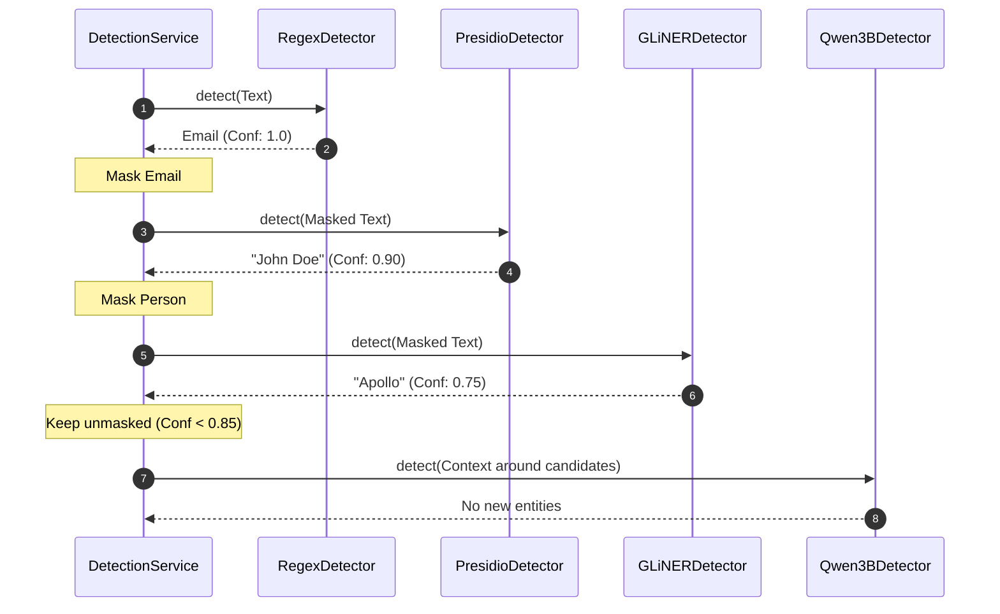
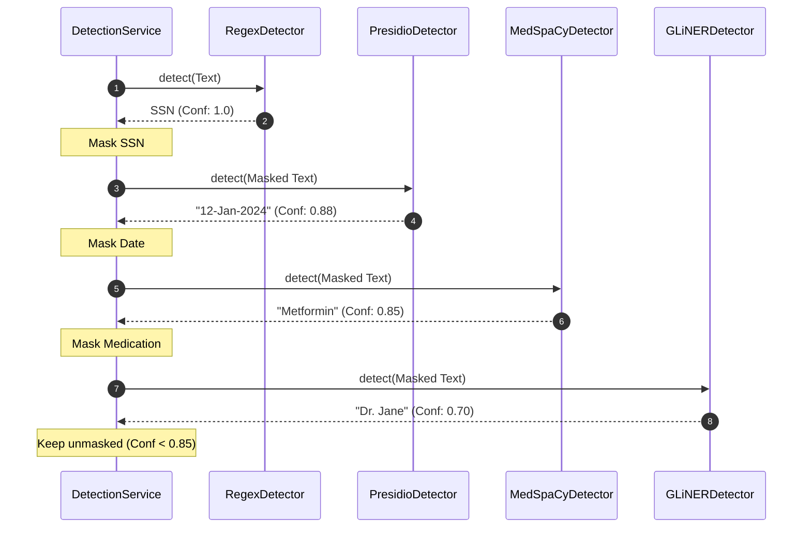

# Detection Pipeline Architecture: DocShield-AI

This document provides a comprehensive technical audit, architectural mapping, and debugging analysis of the DocShield-AI dynamic detection pipeline.

---

## 1. Overview

DocShield-AI uses a cascading, multi-engine pipeline to extract PII (Personally Identifiable Information) and PHI (Protected Health Information) from structured, semi-structured, and unstructured document text. The architecture is designed to optimize latency, API cost, and accuracy by prioritizing fast, high-confidence deterministic rules and named entity recognizers, cascading to deep-learning models, and invoking Local LLMs only for validation or unresolved candidate spans.

---

## 2. Detection Pipeline Architecture

### Generic Flow
```
Regex ➔ Presidio ➔ GLiNER ➔ Ollama/Qwen (Qwen 3B Semantic Reasoning)
```

### Healthcare Flow
```
Regex ➔ Presidio ➔ MedSpaCy ➔ GLiNER ➔ Ollama/Qwen (Qwen 3B Semantic Reasoning)
```

---

## 3. Complete Cascade Logic

### Step 1: Regex
- **Input**: The original document text page.
- **Rules**: Scans structured patterns (SSN, credit card, phone, email, NPI).
- **Early Finalization**: If an entity's confidence is `>= High Confidence Threshold (0.85)`, the span is added to `MaskManager` immediately.
- **Bypass**: Spans with confidence `< 0.85` are registered as unresolved and passed to subsequent stages.

### Step 2: Presidio
- **Input**: `state.current_text` (where resolved high-confidence spans from Step 1 are replaced with spaces of equal length).
- **Rules**: Identifies standard entity types (Person, Location, Date_Time, Organization).
- **Escalation**: If Presidio matches an existing unresolved span and yields a higher confidence score, the entity is updated. If the new score is `>= 0.85`, it is masked.

### Step 3: MedSpaCy (Healthcare Only)
- **Input**: `state.current_text` (unresolved spans).
- **Rules**: Extracts medical/clinical elements (Diseases, Symptoms, Medications, Procedures).

### Step 4: GLiNER
- **Input**: `state.current_text` (unresolved spans).
- **Rules**: Extracts semantic healthcare roles (Doctor, Patient) and facilities.

### Step 5: Ollama/Qwen (Semantic Reasoning)
- **Input**: Bounded local context windows surrounding remaining unmasked candidates.
- **Rules**: Qwen 3B acts as the final safety net to extract missed or complex entities.

---

## 4. Pipeline Components

### `PipelineState`
Maintains execution history, execution time statistics, skipped detectors list, and the character-level mask tracking via `MaskManager`. It also generates bounded context windows (default 160 characters) around residual unresolved candidate spans.

### `MaskManager`
Maintains a boolean mask array representing the claim status of each character index. `remaining_text()` replaces masked index positions with blank space characters, preserving the original character offsets for downstream engines.

---

## 5. Candidate Lifecycle

1. **Generation**: Line-level matchers, proper nouns, signal words, and structured patterns are scanned within `state.current_text`.
2. **Filtering**: Any candidate span that overlaps with an already masked character index is ignored.
3. **Context Selection**: Bounded contexts (default 160 characters) are centered around candidates and sent to the LLM (Qwen 3B) to resolve missing entities.

---

## 6. Entity Lifecycle

1. **Detection**: Extracted by a detector.
2. **Deduplication**: Exact duplicate coordinates are merged; overlap resolution determines the final boundaries.
3. **Calibration**: Standardizes confidence scores across various detection engines.
4. **Post-Processing**: Discards line-break crossings, performs contextual re-classification, and associates medications with nearby dosages.

---

## 7. Confidence & Masking Strategies

- **High Confidence (>= 0.85)**: Instantly triggers masking, replacing characters with spaces to block subsequent detectors.
- **Medium/Low Confidence (< 0.85)**: Passed downstream for potential promotion or validation by the Qwen 8B validator.
- **Masking Mechanism**: Index-preserving spaces prevent offset shifts but disrupt sentence grammar in NLP parsing.

---

## 8. Sequence Diagrams

### Generic Cascade


### Healthcare Cascade


---

## 9. Bugs Found & Recommended Fixes

### 1. Deduplicator Span Preemption
- **Location**: [deduplicator.py:L56-L88](file:///c:/Users/lenovo/Desktop/Data%20Factz%20Projects/DocShield-AI/modules/detection/deduplicator.py#L56-L88)
- **Root Cause**: `Deduplicator.deduplicate` performs overlap filtering using length descending sorting before `_resolve_overlapping_spans` can execute.
- **Impact**: Authoritative priorities (such as prioritizing Regex/Presidio over GLiNER/Qwen) are ignored.
- **Fix**: Remove the overlap resolution loop from `Deduplicator.deduplicate`, limiting it to merging exact duplicates.

### 2. Proper Noun Quantifier Issue
- **Location**: [pipeline_state.py:L114](file:///c:/Users/lenovo/Desktop/Data%20Factz%20Projects/DocShield-AI/modules/detection/pipeline_state.py#L114)
- **Root Cause**: `PROPER_NOUN_PATTERN` requires at least two capitalized words.
- **Impact**: Standalone names are not registered as candidates, causing premature pipeline early stopping.
- **Fix**: Change regex quantifier to `{0,4}`.

### 3. Redundant Qwen 3B Orchestration
- **Location**: [service.py:L612-L613](file:///c:/Users/lenovo/Desktop/Data%20Factz%20Projects/DocShield-AI/modules/detection/service.py#L612-L613)
- **Root Cause**: `"qwen3b"` is appended to the dynamic sequential route and also run in the semantic reasoning stage.
- **Impact**: Double LLM calls on the document, wasting latency.
- **Fix**: Remove `"qwen3b"` from the dynamic routing loop.

---

## 10. Conclusion & Roadmap

The DocShield-AI pipeline features a robust cascading structure, but deduplication overlap preemption, improper proper noun heuristics, and duplicate LLM execution degrade its performance. Implementing the Phase 1 and Phase 2 fixes will align the code with the expected architecture.
