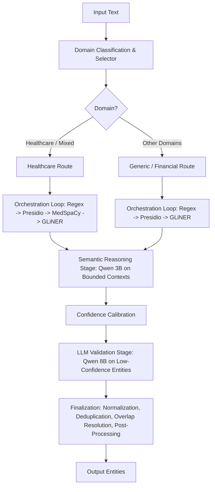
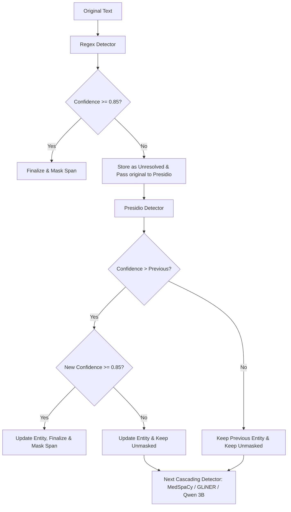
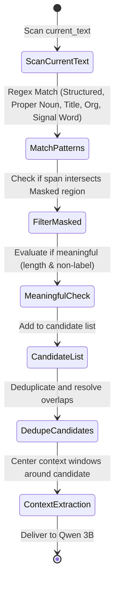
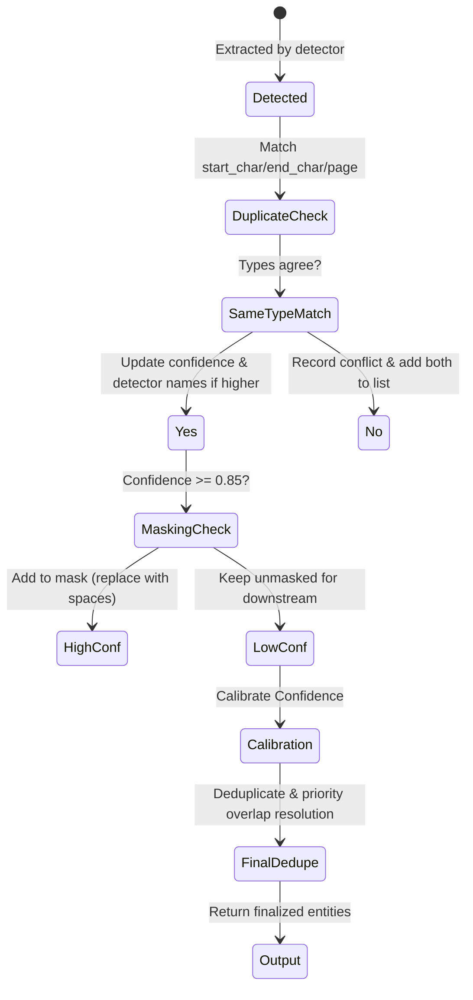
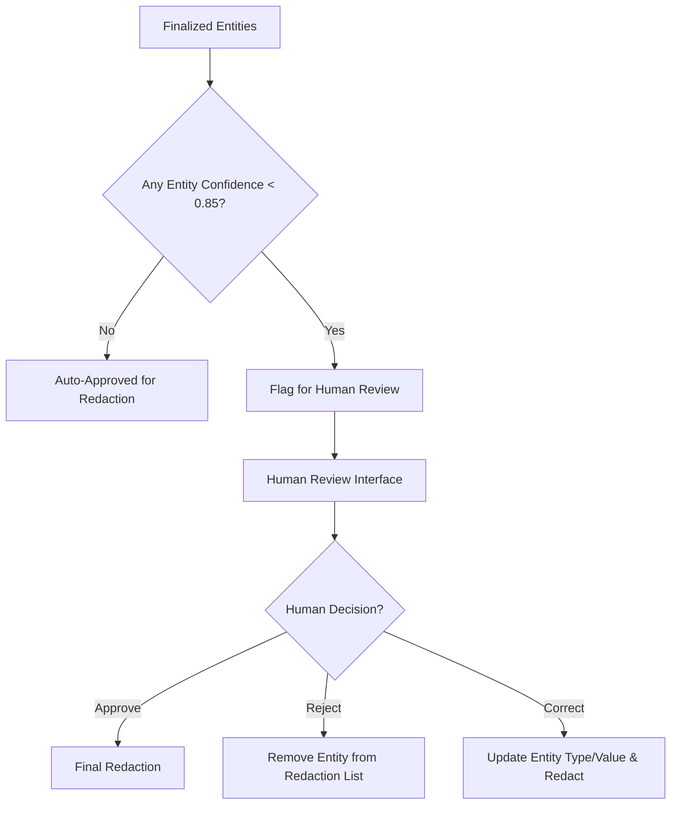
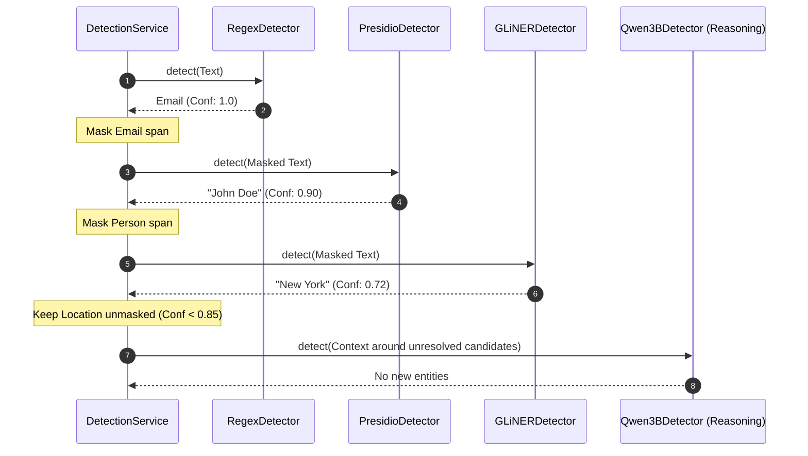
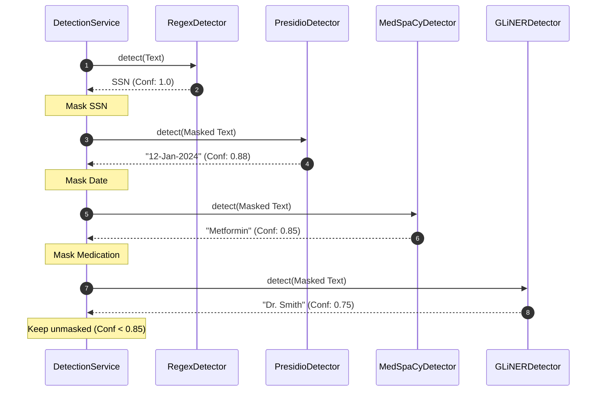
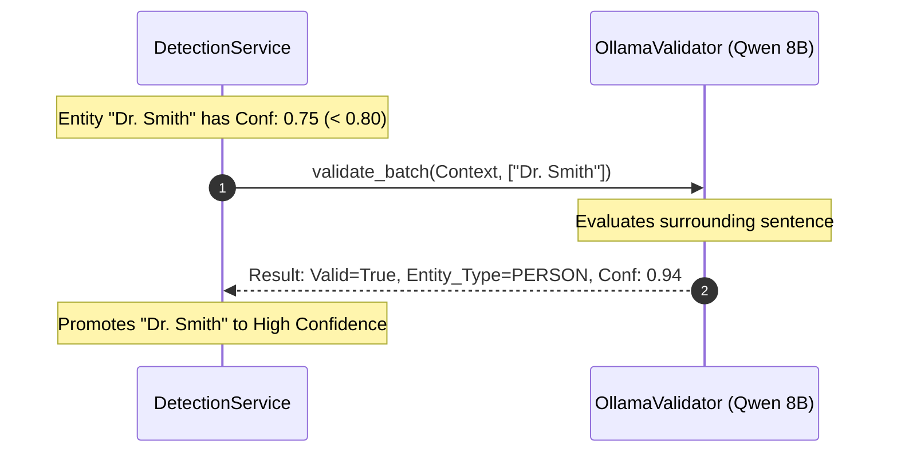
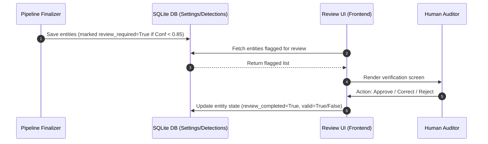

# Detection Pipeline Architecture Review: DocShield-AI

This document provides a comprehensive architectural review, code audit, debugging analysis, and technical documentation of the dynamic detection pipeline in **DocShield-AI**.

---

## 1. Overview

### Purpose of the Pipeline
The DocShield-AI detection pipeline is a multi-stage, hybrid PII/PHI extraction system designed to identify and protect sensitive information in various document types. It leverages a cascading architecture combining fast deterministic rules (Regex), classical named entity recognition (Presidio/spaCy), specialized clinical NLP (MedSpaCy), deep learning models (GLiNER), and Local Large Language Models (Ollama/Qwen) to balance latency, accuracy, and cost.

### Supported Document Domains
- **Healthcare**: Medical records, lab reports, prescriptions, and discharge summaries.
- **Financial**: Bank statements, invoices, tax forms, receipts, and insurance claims.
- **Legal**: Agreements, contracts, and legal briefs.
- **Corporate**: Resumes, corporate communications, and employee records.
- **Generic**: Standard text, identity documents, and mixed files.

### Supported Detectors
1. **RegexDetector**: High-speed pattern matching for highly structured PII/PHI (SSNs, phone numbers, emails, NPI numbers, credit cards).
2. **PresidioDetector**: Named entity extraction for general PII/PHI (Persons, Locations, Dates, Organizations).
3. **MedSpaCyDetector**: Clinical extraction for specialized medical items (Diseases, Medications, Procedures, Symptoms, Labs).
4. **GLiNERDetector**: Zero-shot/few-shot entity extraction targeting healthcare roles and medical facility names.
5. **Qwen3BDetector**: Semantic extraction targeting unresolved text fragments and complex contexts.
6. **OllamaValidator (Qwen 8B)**: Post-processing LLM-assisted validation specifically for low-confidence entities.

---

## 2. Detection Flow

The pipeline executes a sequential cascading detection flow based on the classified document domain. It processes text page-by-page, dynamically applying detectors to the remaining unmasked text.

### Generic / Financial Flow
```
Regex ➔ Presidio ➔ GLiNER ➔ Ollama/Qwen (Semantic Reasoning)
```
1. **Regex**: Identifies structured identifiers and masks them early if confidence is high.
2. **Presidio**: Extracts general entity types (Person, Org, Location) on the remaining text.
3. **GLiNER**: Extracts semantic roles (Patient, Doctor, Hospital) on the remaining text.
4. **Ollama/Qwen**: Scans unresolved text candidates in local context windows to find missed or complex entities.

### Healthcare Flow
```
Regex ➔ Presidio ➔ MedSpaCy ➔ GLiNER ➔ Ollama/Qwen (Semantic Reasoning)
```
1. **Regex**: Identifies structured clinical identifiers (NPI, claim numbers) and masks high-confidence matches.
2. **Presidio**: Extracts basic entities (Persons, Dates) on the remaining text.
3. **MedSpaCy**: Extracts clinical terms (Diseases, Medications, Procedures) on the remaining text.
4. **GLiNER**: Extracts clinical semantic roles (Physician, Patient, Facility) on the remaining text.
5. **Ollama/Qwen**: Scans unresolved text candidates in local context windows to locate hidden clinical concepts.

---

## 3. Architecture Diagrams

### Overall Pipeline Diagram


### Detector Cascade & Masking Lifecycle


### Candidate Lifecycle


### Entity Lifecycle


### Human Review Flow


### Redaction Flow
```mermaid
graph TD
    A[Approved Entities] --> B[Sort Entities in Reverse Order of Start Offsets]
    B --> C[Loop Through Entities]
    C --> D[Replace original text at offsets with [ENTITY_TYPE]]
    D --> E[Verify no offset shifts occurred]
    E --> F[Output Redacted Document]
```

---

## 4. Pipeline Components

### `DetectionService`
- **File**: [service.py](file:///c:/Users/lenovo/Desktop/Data%20Factz%20Projects/DocShield-AI/modules/detection/service.py)
- **Role**: Coordinates the entire pipeline. Classifies the domain, loops through selected detectors, runs local semantic reasoning, validates low-confidence entities with Qwen 8B, and applies final normalization, deduplication, and medication-dosage associations.

### `PipelineState`
- **File**: [pipeline_state.py](file:///c:/Users/lenovo/Desktop/Data%20Factz%20Projects/DocShield-AI/modules/detection/pipeline_state.py)
- **Role**: Maintains execution history, latency metrics, resolved entity lists, and the character-level mask array via `MaskManager`. It also generates context windows around unresolved candidates.

### `MaskManager`
- **File**: [mask_manager.py](file:///c:/Users/lenovo/Desktop/Data%20Factz%20Projects/DocShield-AI/modules/detection/mask_manager.py)
- **Role**: Maintains a boolean mask array representing masked characters. Replaces masked characters with space characters of equal length in `remaining_text()` to keep index offsets aligned.

### `DetectorSelector`
- **File**: [detector_selector.py](file:///c:/Users/lenovo/Desktop/Data%20Factz%20Projects/DocShield-AI/modules/detection/analyzer/detector_selector.py)
- **Role**: Uses domain keyword cues to classify documents into routes and selects the next detector based on whether it has run and whether any candidate text remain.

### `Deduplicator`
- **File**: [deduplicator.py](file:///c:/Users/lenovo/Desktop/Data%20Factz%20Projects/DocShield-AI/modules/detection/deduplicator.py)
- **Role**: Combines exact duplicate spans into one record and performs span overlap resolution.

---

## 5. Detector Responsibilities

### RegexDetector
- **Input**: `state.current_text` (masked view).
- **Entities**: Structured PII (Email, Phone, SSN, Credit Cards, Zip Codes, NPI, Member ID, Claim Number).
- **Confidence**: Assumed 1.0 (or high confidence if matched).
- **Downstream**: Spans matched are masked immediately if they exceed 0.85, preventing subsequent detectors from seeing them.

### PresidioDetector
- **Input**: `state.current_text` (masked view).
- **Entities**: General PII (Person, Location, Date_Time, Organization, Address).
- **Confidence**: Score returned by Presidio engine (0.0 to 1.0).
- **Downstream**: High-confidence entities are masked, low-confidence entities are left unmasked.

### MedSpaCyDetector
- **Input**: `state.current_text` (masked view).
- **Entities**: Clinical PHI (Problem, Medication, Procedure, Lab, Symptom, Diagnosis, Allergy, Vital_Sign, Disease).
- **Confidence**: `DEFAULT_CONFIDENCE` (0.85) if spaCy pipeline runs successfully, or `FALLBACK_CONFIDENCE` (0.78) for fallback rules.
- **Downstream**: Clinical concepts are extracted from remaining text.

### GLiNERDetector
- **Input**: `state.current_text` (masked view).
- **Entities**: Healthcare roles and facilities (Doctor, Patient, Hospital, Nurse, Medical_Facility, Physician).
- **Confidence**: Model predictions score (>= 0.70) or `FALLBACK_CONFIDENCE` (0.76).
- **Downstream**: Resolves remaining semantic entities before LLM fallback steps.

### Qwen3BDetector
- **Input**: Bounded local context windows (original text segments around unresolved candidates).
- **Entities**: Unresolved entities matching any standard taxonomy category.
- **Confidence**: Extracted model prediction score.
- **Downstream**: Contributes candidates that were missed or had low confidence in previous stages.

### OllamaValidator (Qwen 8B)
- **Input**: Context string enclosing the entities, along with a batch of low-confidence entities.
- **Entities**: Validates any input entity category.
- **Confidence**: Clamps and applies calibrated scores returned by the LLM validator.
- **Downstream**: Decides whether each entity is valid (or `NOT_PII`).

---

## 6. Candidate Lifecycle

1. **Generation**: `remaining_candidate_summary` scans `state.current_text` for line-level cues, structured tokens, titles, proper noun chains, organizations, and signal words.
2. **Filtering**: Spans that intersect already masked characters are immediately ignored.
3. **Validation**: Candidate values are checked against ignore lists (e.g. headers/footers) and must have at least 3 character length (ignoring punctuation).
4. **Deduplication**: Candidate spans are deduplicated to ensure no nested or exact overlaps remain.
5. **Context Center**: Unresolved candidates are centered in local context windows (default 160 characters) and sent to Qwen 3B.

---

## 7. Entity Lifecycle

1. **Detection**: Entities are returned by detectors.
2. **Span Matching**: If an entity matches an existing span:
   - If the type matches, the confidence and detector names are updated if the new score is higher.
   - If the type is different, both are saved as conflicting types.
3. **Masking Check**: If the confidence is >= `high_confidence_threshold` (0.85), the span is masked (replaced with spaces) in `MaskManager`.
4. **Aggregation**: Low-confidence entities are preserved, validated by Qwen 8B, normalized by `EntityMapper`, and deduplicated.
5. **Post-Processing**: Discards line-break crossings, performs contextual reclassifications, associates close medications and dosages, and calibrates confidence levels.

---

## 8. Confidence Handling

### Thresholds
- **High (>= 0.85)**: Entity is accepted and masked early.
- **Medium (>= 0.60)**: Entity is stored, skipped from early masking, and passed to subsequent detectors.
- **Low (< 0.60)**: Passed downstream and validated by Qwen 8B at the end.

### Replacement & Escalation
- If a subsequent detector matches a low-confidence span and assigns a higher confidence score, the entity's score is escalated.
- If the new score exceeds 0.85, the entity is finalized and the span is masked.

---

## 9. Masking Strategy

- Masking is performed using **index-preserving spaces** instead of deleting characters or using tokens.
- This ensures that character offsets returned by later engines (such as deep learning models) correspond directly to the original document coordinates, eliminating coordinate tracking complexity.
- **Limitation**: Fragmenting sentences with spaces breaks natural language grammar, degrading contextual syntactic accuracy in models like spaCy and GLiNER.

---

## 10. Dynamic Routing

- Classification maps document types/keywords to domains: healthcare, financial, legal, corporate, mixed, or generic.
- A route tuple is generated (e.g. `Regex -> Presidio -> MedSpaCy -> GLiNER`).
- At each step, `select_next_detector` verifies if the detector should run (checks `should_run` heuristics, e.g., checking if the client is available or if candidate counts exceed the stopping threshold).

---

## 11. Human Review

- Any entity that finishes with a confidence score `< 0.85` or is marked as conflicting is flagged for human review.
- Telemetry details (detecting model, original types, conflicting types, reasoning logs from validator) are packed in the metadata to assist human operators in making decisions.

---

## 12. Redaction

- Entities are redacted in **descending offset order** (starting from the end of the text) to prevent offset shifts.
- Character spans are replaced with `[ENTITY_TYPE]` labels.

---

## 13. Configuration Options

| Variable | Description | Default |
| :--- | :--- | :--- |
| `BYPASS_LLM` | Skip all LLM evaluations (Qwen 3B, Qwen 8B) | `false` |
| `DETECTION_LLM_ENABLED` | Enable LLM orchestration in sequential route | `true` |
| `DETECTION_UNRESOLVED_LLM_ENABLED` | Enable Qwen 3B semantic extraction phase | `true` |
| `DETECTION_HIGH_CONFIDENCE_THRESHOLD` | Threshold to trigger early masking | `0.85` |
| `DETECTION_LLM_VALIDATION_THRESHOLD` | Threshold below which Qwen 8B validation runs | `0.80` |
| `DETECTION_LLM_CONTEXT_WINDOW` | Character context window for local LLM calls | `160` |

---

## 14. Sequence Diagrams

### Generic Document Cascade


### Healthcare Document Cascade


### Low-Confidence Validation Cascade


### Human Review Workflow


---

## 15. Problems Found

| Issue | Root Cause | Location | Impact | Severity | Recommended Fix | Status |
| :--- | :--- | :--- | :--- | :--- | :--- | :--- |
| **Deduplicator Overrides Cascade Priorities** | `Deduplicator.deduplicate` resolves overlaps using length descending sorting *before* `_resolve_overlapping_spans` can apply authoritative rules. | [deduplicator.py:L56-L88](file:///c:/Users/lenovo/Desktop/Data%20Factz%20Projects/DocShield-AI/modules/detection/deduplicator.py#L56-L88) | Shorter high-priority/authoritative detections are discarded in favor of longer low-confidence ones. | **Critical** | Disable span overlap resolution inside the Deduplicator. Let it only merge exact duplicates, and let `_resolve_overlapping_spans` handle actual overlaps. | Open |
| **Qwen 3B Double Invocation** | `qwen3b` is added to the sequential orchestration route and also executed in the `_run_semantic_reasoning_if_needed` stage. | [service.py:L612-L613](file:///c:/Users/lenovo/Desktop/Data%20Factz%20Projects/DocShield-AI/modules/detection/service.py#L612-L613) | Performance bottleneck. Double LLM calls on full text and context windows, wasting tokens and time. | **High** | Do not append `"qwen3b"` to the orchestration route in `_execute_dynamic_orchestration`. Dedicate Qwen 3B to candidate-context reasoning only. | Open |
| **Proper Noun Regex Ignores Single Words** | `PROPER_NOUN_PATTERN` requires at least two capitalized words due to the `{1,4}` quantifier. | [pipeline_state.py:L114](file:///c:/Users/lenovo/Desktop/Data%20Factz%20Projects/DocShield-AI/modules/detection/pipeline_state.py#L114) | Single capitalized nouns (e.g. names, single cities) are not counted as candidates, causing premature pipeline early stopping. | **High** | Change regex quantifier to `{0,4}` to support single proper nouns. | Open |
| **Detector Telemetry Overwritten** | `_matches_previous_entity` replaces the detector name with `entity.detector` on confidence escalation. | [service.py:L478](file:///c:/Users/lenovo/Desktop/Data%20Factz%20Projects/DocShield-AI/modules/detection/service.py#L478) | Telemetry loss. Multi-detector confirmation details are wiped out for exact duplicates of the same type. | **Medium** | Merge detector names using `Deduplicator._merged_detectors(previous.detector, entity.detector)` instead of replacing. | Open |
| **Fragmented Sentences from Spaces Masking** | Masking replaces entities with empty spaces. | [mask_manager.py:L39](file:///c:/Users/lenovo/Desktop/Data%20Factz%20Projects/DocShield-AI/modules/detection/mask_manager.py#L39) | Degrades accuracy of downstream context-aware models (MedSpaCy, GLiNER, Qwen) due to broken sentence grammar. | **Medium** | Replace with equal-length indicators (e.g., `X` chars) or feed original text alongside masking coordinates to NLP models. | Open |
| **Ineffective Overlap Priority Resolver** | `_resolve_overlapping_spans` has no overlaps left to resolve because Deduplicator runs first. | [service.py:L839](file:///c:/Users/lenovo/Desktop/Data%20Factz%20Projects/DocShield-AI/modules/detection/service.py#L839) | Cascade priority sorting, authoritative owners, and detector weights are completely ignored. | **Medium** | Running Deduplicator before priority overlap resolution causes the bug; resolve exact duplicates first, then resolve overlaps. | Open |
| **Case-Sensitive BYPASS_LLM check** | Capitalized `"True"` string was not matched. | [qwen_detector.py:L63](file:///c:/Users/lenovo/Desktop/Data%20Factz%20Projects/DocShield-AI/modules/detection/detectors/qwen_detector.py#L63) | Qwen detector executed even when bypass was enabled in the environment. | **Low** | Use case-insensitive verification (already implemented in recent fixes). | **Fixed** |
| **Qwen 3B Token Starvation** | Restricted `num_predict: 256` token limit. | [qwen_detector.py:L134](file:///c:/Users/lenovo/Desktop/Data%20Factz%20Projects/DocShield-AI/modules/detection/detectors/qwen_detector.py#L134) | Thinking process of `qwen3:4b` reasoning model exhausted tokens, returning empty JSON content. | **High** | Increased token limit to `1024` and added empty content warnings (already implemented in recent fixes). | **Fixed** |
| **Uncaught Exception in Qwen parsing** | Validation and parse errors in `model_validate_json` threw tracebacks. | [qwen_detector.py:L149](file:///c:/Users/lenovo/Desktop/Data%20Factz%20Projects/DocShield-AI/modules/detection/detectors/qwen_detector.py#L149) | Parser failures crashed detector and returned full tracebacks instead of returning empty results gracefully. | **Medium** | Wrap validation in try/except block with warning logs (already implemented in recent fixes). | **Fixed** |

---

## 16. Improvement Recommendations

### Short-Term (Immediate Fixes)
1. **Fix Deduplicator Overlap Resolution**: Update [deduplicator.py](file:///c:/Users/lenovo/Desktop/Data%20Factz%20Projects/DocShield-AI/modules/detection/deduplicator.py) to only merge exact duplicates. Remove the second loop that performs longest span overlap resolution, leaving that responsibility to `_resolve_overlapping_spans` in [service.py](file:///c:/Users/lenovo/Desktop/Data%20Factz%20Projects/DocShield-AI/modules/detection/service.py).
2. **Fix Proper Noun Candidate Regex**: Modify `PROPER_NOUN_PATTERN` in [pipeline_state.py](file:///c:/Users/lenovo/Desktop/Data%20Factz%20Projects/DocShield-AI/modules/detection/pipeline_state.py#L114) to `re.compile(r"\b[A-Z][a-z]+(?:\s+[A-Z][a-z]+){0,4}\b")`.
3. **Remove Orchestration Qwen3B**: Remove the code that appends `"qwen3b"` to the orchestration loop route inside [service.py](file:///c:/Users/lenovo/Desktop/Data%20Factz%20Projects/DocShield-AI/modules/detection/service.py#L612-L613) to avoid redundant LLM executions.
4. **Detector telemetry merging**: Update the match logic in `_matches_previous_entity` inside [service.py](file:///c:/Users/lenovo/Desktop/Data%20Factz%20Projects/DocShield-AI/modules/detection/service.py#L478) to merge detector names instead of overwriting them.

### Long-Term (Architectural Improvements)
1. **Context-Preserving Masking**: Instead of replacing characters with blank spaces, implement a masking system that tracks and forwards resolved spans as metadata to deep-learning detectors. This allows models to scan sentences with original grammatical structures intact while ignoring resolved spans post-prediction.
2. **Parallel Detector Execution**: Since early-stage execution has latency, run independent detectors (e.g. Regex and Presidio, or MedSpaCy and GLiNER) in parallel threads, combining their results and performing priority resolution at the end. This reduces processing times for multi-page documents.
3. **Dynamic LLM Validation Routing**: Route entities to Qwen 8B validation based on specific category risks rather than a flat confidence threshold. For example, high-risk items like `SSN` or `DISEASE` should be validated more aggressively than generic `DATE` entries.

---

## 17. Final Conclusion

### Pipeline Maturity
The DocShield-AI detection pipeline has a well-designed sequential structure, but it contains **major architectural bugs** that severely degrade its accuracy, performance, and cascading integrity:
- **Deduplicator overlap resolution** bypasses the priority-based resolver, rendering authoritative weights completely ineffective.
- **Proper noun candidate heuristics** cause premature pipeline termination (early stopping) when single capitalized words are left unresolved.
- **Duplicate Qwen 3B execution** causes significant latency and processing overhead.

### Assessment of Cascading Architecture Match
The current implementation **does not match the intended cascading detection architecture** because the Deduplicator's length-based overlap resolution preempts and deactivates the priority/authoritative-based routing weights. 

By applying the short-term recommendations (fixing the Deduplicator, proper noun regex, and Qwen execution double-run), the pipeline can be brought into complete alignment with the intended cascading architecture.
