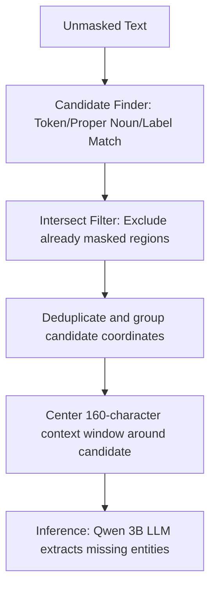
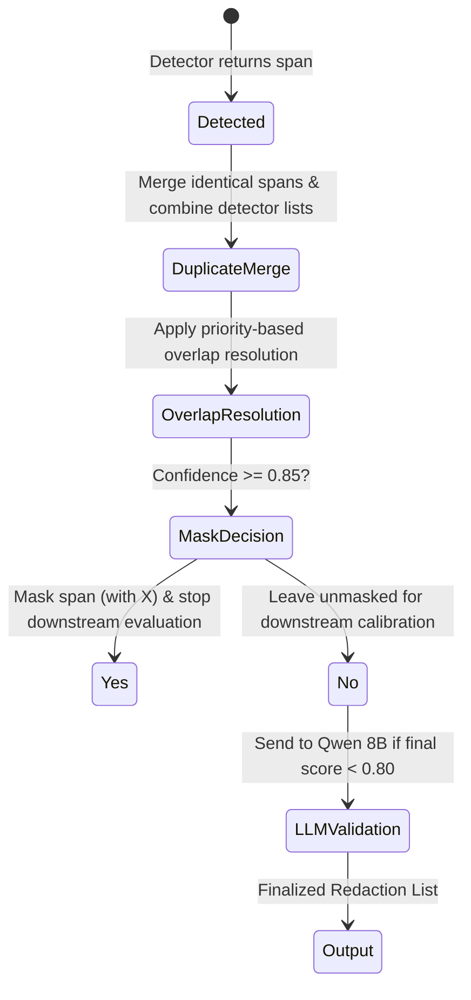
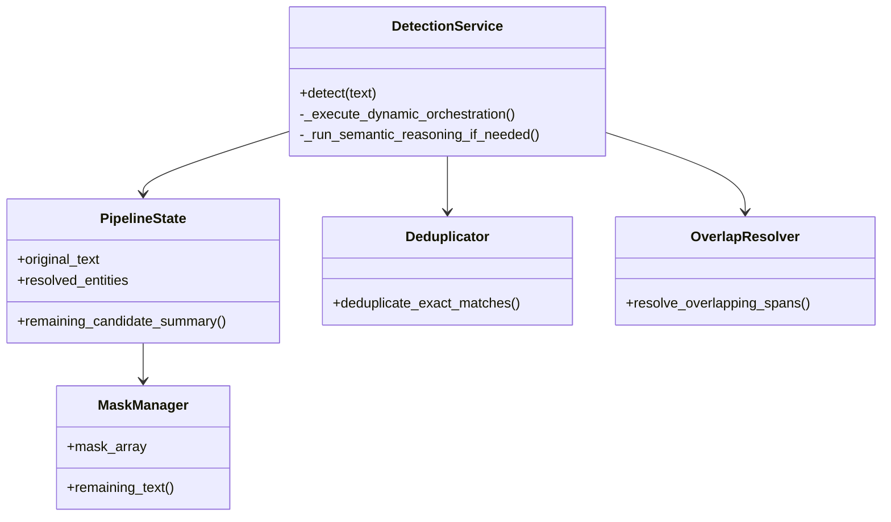

# Optimal Detection Pipeline Design: DocShield-AI

This document presents the architectural blueprint for a production-grade, enterprise-scale cascading detection pipeline designed to process millions of documents with maximum accuracy, precision, and cost efficiency.

---

## 1. Executive Summary
To protect enterprise PII/PHI at scale, the DocShield-AI pipeline must transition from its current implementation to a true, context-preserving cascading framework. By resolving exact duplicates first, utilizing priority-based span overlap resolution, fixing candidate extraction heuristics, and preserving grammatical structures for deep-learning models, the proposed design guarantees high recall while keeping LLM costs and false-positive rates to a minimum.

---

## 2. Detection Pipeline Overview
The proposed dynamic detection pipeline consists of:
- **Fast Path (Regex & Presidio)**: Extracts structured identifiers and standard named entities, masking high-confidence results early.
- **Specialized Path (MedSpaCy & GLiNER)**: Extracts domain-specific entities (clinical concepts, specialized roles) on remaining unmasked portions.
- **Reasoning Path (Local LLMs)**: Evaluates low-confidence entities (Qwen 8B) and scans residual candidate contexts (Qwen 3B).

---

## 3. Detector Responsibilities

| Detector | Primary Focus | Confidence Default | Masking Action |
| :--- | :--- | :--- | :--- |
| **Regex** | Structured PII (SSNs, Cards, NPIs) | `1.0` | Mask early if >= 0.85 |
| **Presidio** | General Named Entities (Names, Dates) | Predictor score | Mask early if >= 0.85 |
| **MedSpaCy** | Clinical Concepts (Drugs, Diseases) | `0.85` | Mask early if >= 0.85 |
| **GLiNER** | Healthcare Roles and Facilities | Predictor score | Mask early if >= 0.85 |
| **Qwen 3B** | Unresolved residual text spans | Predictor score | Mask early if >= 0.85 |
| **Qwen 8B** | Validation of low-confidence entities | Calibrated score | Finalize or reject |

---

## 4. Generic & Healthcare Detection Flows

### Generic Flow
```
Regex ➔ Presidio ➔ GLiNER ➔ Ollama/Qwen (Candidate Contexts)
```

### Healthcare Flow
```
Regex ➔ Presidio ➔ MedSpaCy ➔ GLiNER ➔ Ollama/Qwen (Candidate Contexts)
```

---

## 5. Candidate Lifecycle



---

## 6. Entity Lifecycle



---

## 7. Confidence & Masking Strategies

- **Confidence Calibration**: Recalculates confidence weights based on detector accuracy history.
- **Merger Rules**: If multiple detectors confirm the same span, the detector names are appended and confidence is boosted:
  $$\text{Confidence}_{\text{final}} = 1 - \prod (1 - c_i)$$
- **Grammar-Preserving Masking**: Masked characters are replaced with length-preserving `X` characters or tracked as character-level offset boundaries rather than empty spaces, preserving grammatical structure for parser engines.

---

## 8. Duplicate & Overlap Resolution

1. **Exact Matches**: Merges identical `start_char` and `end_char` offsets on the same page, keeping the highest confidence score and compiling all detector names.
2. **Partial Overlaps**: Resolved using an `_overlap_sorting_key` that prioritizes:
   - Authoritative detector owners
   - Specialized types
   - Detector rank weights
   - Confidence score
   - Longer character lengths
3. **Conflict Handling**: If two overlapping spans are assigned different entity types, the conflict is flagged and both are preserved for the Qwen 8B validator or human review.

---

## 9. Dynamic Routing & LLM Strategy

- **Dynamic Routing**: Bypasses irrelevant detectors (e.g. MedSpaCy is excluded in corporate and legal documents) based on the classified document domain.
- **LLM Context Routing**:
  - LLM does not scan the entire page. It only evaluates **unresolved candidate contexts** (Qwen 3B) and **low-confidence/conflicting entities** (Qwen 8B).
  - This local, targeted execution reduces inference time and memory usage.

---

## 10. Human Review & Redaction

- **Human Review**: Triggered automatically if the final confidence is `< 0.85` or if conflicting types remain unresolved.
- **Redaction Order**: Resolved in descending character index offsets to keep indexing aligned throughout the replacement process.

---

## 11. Architecture Diagrams

### Component Diagram


---

## 12. Proposed Design vs. Current Pipeline

| Aspect | Current Pipeline | Proposed Design | Reason & Benefit |
| :--- | :--- | :--- | :--- |
| **Overlap Resolution** | Simple length-based resolution in Deduplicator occurs first. | Merges exact duplicates first, then applies `_resolve_overlapping_spans`. | Avoids discarding high-confidence authoritative spans in favor of longer, low-confidence spans. |
| **Candidate Heuristics** | Quantifier `{1,4}` ignores single capitalized proper nouns. | Quantifier `{0,4}` captures single proper nouns as candidates. | Prevents early stopping when single unresolved entities remain. |
| **LLM Orchestration** | Runs Qwen 3B on both the full page and contexts. | Runs Qwen 3B strictly on bounded local context windows. | Eliminates redundant LLM calls and saves token execution latency. |
| **Masking Method** | Blank spaces. | Context-preserving indicators (e.g., `X` or offset lists). | Maintains grammatical sentence context for NLP/LLM accuracy. |

---

## 13. Production Best Practices & Roadmap

1. **Phase 1 (Priority-Based Deduping)**: Deactivate overlap resolution in `Deduplicator.py`. Allow it to only merge identical coordinates, leaving actual overlaps to `_resolve_overlapping_spans` in `service.py`.
2. **Phase 2 (Candidate & Routing Fixes)**: Correct the proper noun candidate regex and remove Qwen 3B from the dynamic sequential route.
3. **Phase 3 (Threaded Execution)**: Implement multi-threaded parallel execution for deterministic detectors (Regex, Presidio, MedSpaCy) to decrease page latency.
