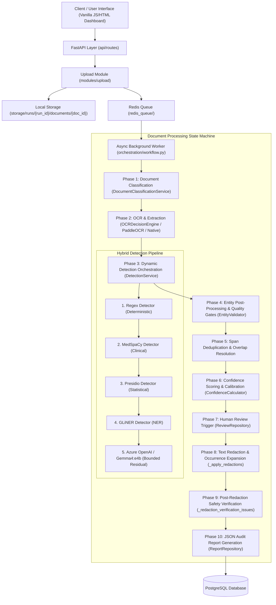

# DocShield-AI: End-to-End Technical Master Book & Architecture Specification

> **PoC Status**: Functional Proof-of-Concept for Enterprise PII/PHI Detection, Confidence Calibration, Human Review Routing, and Automated Redaction.

---

## 1. Executive Summary & Core Mission

**DocShield-AI** is a hybrid intelligence document redaction system engineered specifically for healthcare and enterprise compliance workloads. Healthcare and financial documents contain dense, unstructured mixtures of **Personally Identifiable Information (PII)** and **Protected Health Information (PHI)**.

### Core Objectives
1. **High-Precision Multi-Layer Detection**: Combine deterministic rule engines, clinical NLP (MedSpaCy), statistical named-entity recognition (GLiNER & Presidio), and bounded semantic LLMs (`gpt-5.4-mini` via Azure OpenAI or `gemma4:e4b` via Ollama).
2. **Confidence-Calibrated Human Review Routing**: Entities with confidence $< 80\%$ (or flagged by risk heuristics) automatically trigger a human review workflow, preventing unvalidated auto-redactions.
3. **Deterministic Quality & Noise Gates**: Clean field prefixes (`"SSN: 123-45-6789"` $\rightarrow$ `"123-45-6789"`), enforce mandatory digit requirements for phone numbers, filter form header noise, and eliminate audit sentence descriptions.
4. **Occurrence Expansion & Post-Redaction Verification**: Expand entity occurrences across multi-page document text and verify redaction completeness before releasing output files.

---

## 2. Technology Stack & Environment

| Component | Technology | Purpose |
|---|---|---|
| **Backend API** | Python 3.10+, FastAPI, Pydantic | RESTful routes, async job orchestration, OpenAPI schemas |
| **Database** | PostgreSQL 15+, SQLAlchemy ORM | Relational models (`Run`, `Document`, `Entity`, `Review`, `Redaction`, `Report`) |
| **Queue / Async** | Redis 7+, Celery / Custom Redis Queue | Asynchronous background processing worker |
| **OCR & Text Extraction** | PyMuPDF (`fitz`), PaddleOCR | Native PDF text extraction & optical character recognition |
| **Deterministic Detection** | Regex (Custom compiled expressions) | SSNs, Phone Numbers, ICD-10, CPT, Dates, Zip Codes, Insurance IDs |
| **Clinical NLP Engine** | MedSpaCy / Clinical Heuristics | Diseases, symptoms, lab tests (`Lipid Panel`, `HbA1c`), medications, procedures |
| **Statistical NER** | GLiNER, Microsoft Presidio | Person names, patient names, doctor names, healthcare organizations |
| **Semantic LLM Layer** | Azure OpenAI (`gpt-5.4-mini`) or Ollama (`gemma4:e4b`) | Bounded-context residual entity discovery and candidate validation |
| **Frontend UI** | Vanilla HTML5 / JavaScript (ES6) / Vanilla CSS | Admin Dashboard, Document Review Workspace, Review Queue |

---

## 3. High-Level System Architecture



---

## 4. End-to-End Pipeline Workflow (Phases 1–10)

### Phase 1: File Ingestion & UUID Tree Storage Layout
- File uploads generate a unique `Run` ID (`RUN-000001` via `RunSequence` with atomic locking) and individual `Document` record (`UUIDv4`).
- Storage layout follows a strict hierarchical tree:
  `storage/runs/{run_id}/documents/{document_id}/{original,extracted,redacted}/` + `report.json`

### Phase 2: Classification & OCR Extraction
- `DocumentClassificationService` determines document domain (`healthcare` vs `generic`).
- `OCRDecisionEngine` selects optimal engine (`NATIVE_PDF`, `PADDLEOCR`, or `MIXED`).
- Extracted text is stored in `ocr_results` and cached for checkpointing.

### Phase 3: Dynamic Detection Orchestration
- Detectors run sequentially based on domain route selected by `DetectorSelector`:
  - **Healthcare Route**: `Regex` $\rightarrow$ `MedSpaCy` $\rightarrow$ `Presidio` $\rightarrow$ `GLiNER` $\rightarrow$ `LLM (gpt-5.4-mini / gemma4:e4b)`
  - **Generic Route**: `Regex` $\rightarrow$ `Presidio` $\rightarrow$ `GLiNER` $\rightarrow$ `LLM (gpt-5.4-mini / gemma4:e4b)`

### Phase 4: Entity Post-Processing & Quality Gates (`EntityValidator`)
1. **Form Prefix Stripping**: Strips field labels (`"SSN: 123-45-6789"` $\rightarrow$ `"123-45-6789"`).
2. **Mandatory Digit Check for Phones**: `PHONE_NUMBER` candidates must contain $\ge 7$ digits.
3. **Audit Verb & Word Limit Filter**: Rejects candidates containing audit report terms (`disclosed`, `exposed`, `repeated`, `references`, `documentation`, `noted`, `disclosures`, `compliance`, `policy`, `portal`, `leak`, `sharing`, `tokenize`, `tracking`, `identifiers`, `plans`, `response`, `review`, `communication`, `distribution`, `redaction`). Rejects non-address candidates $> 4$ words.
4. **Header Noise Rejection**: Rejects generic table/form labels (`"Amount Billed"`, `"VisitDate"`, `"Patient Responsibility"`, `"Weight"`).

### Phase 5: Span Deduplication & Overlap Resolution
- Overlapping character spans are resolved using priority ranking:
  $$\text{Priority Key} = (\text{is\_authoritative}, \text{type\_rank}, \text{detector\_priority}, \text{confidence\_score}, \text{span\_length})$$

### Phase 6: Confidence Scoring & Human Review Routing
- Confidence thresholds:
  - **HIGH ($\ge 0.80$)**: Auto-Approved.
  - **MEDIUM / LOW ($< 0.80$)**: Triggers entry into the `Review` repository for human approval/rejection.
- MedSpaCy scores are capped at $0.95$ to avoid over-confidence bias.

### Phase 7: Text Redaction & Occurrence Expansion
- `_expand_entity_occurrences(text, detections)` scans the complete multi-page document text for all confirmed entity values.
- Spans are sorted right-to-left (descending `start_char`) and replaced with category mask labels (e.g. `[REDACTED_PATIENT]`, `[REDACTED_SSN]`).

### Phase 8: Post-Redaction Safety Verification
- Verification function `_redaction_verification_issues()` checks:
  1. `ENTITY_SPAN_VALUE_MISMATCH`: Text span offset mismatch.
  2. `DETECTED_VALUE_REMAINS`: Un-masked entity string still found in output text.
  3. `DETERMINISTIC_PII_REMAINS`: Residual regex safety check fails.
- Output is blocked if any verification issue is raised.

---

## 5. Critical Files & Responsibilities

| Component | File Path | Primary Responsibility |
|---|---|---|
| **Workflow State Machine** | [`orchestration/workflow.py`](file:///E:/Office/DocShield-AI/orchestration/workflow.py) | Main execution loop, state management, redaction, safety checks |
| **Detection Service** | [`modules/detection/service.py`](file:///E:/Office/DocShield-AI/modules/detection/service.py) | Dynamic pipeline orchestration, detector selection, audit logging |
| **Quality Validator** | [`modules/detection/validators/entity_validator.py`](file:///E:/Office/DocShield-AI/modules/detection/validators/entity_validator.py) | Field prefix trimming, phone digit checks, verb phrase rejection |
| **Azure LLM Detector** | [`modules/detection/detectors/azure_detector.py`](file:///E:/Office/DocShield-AI/modules/detection/detectors/azure_detector.py) | `gpt-5.4-mini` candidate validation & residual discovery |
| **Gemma LLM Detector** | [`modules/detection/detectors/gemma_detector.py`](file:///E:/Office/DocShield-AI/modules/detection/detectors/gemma_detector.py) | `gemma4:e4b` candidate validation & residual discovery |
| **Privacy Mapper** | [`modules/detection/entity_mapper.py`](file:///E:/Office/DocShield-AI/modules/detection/entity_mapper.py) | Mapping entity types to PII vs PHI compliance categories |
| **Run Tracking** | [`database/repositories/run_repository.py`](file:///E:/Office/DocShield-AI/database/repositories/run_repository.py) | Atomic sequence counters (`RUN-000001`), run state transitions |

---

## 6. Key Challenges & Architectural Solutions

### Challenge 1: LLM Candidate Over-Confirmation & Sentence Fragment Leakage
* **Problem**: Unbounded LLM residual extraction flagged audit report bullet points (`"Direct references to diagnosis..."`, `"Personal phone and fax numbers disclosed"`) as PII/PHI.
* **Solution**: Implemented `EntityValidator._is_rejected_semantic_value()` with verb phrase blacklists, mandatory $\ge 7$ digit requirements for phone numbers, and a 4-word max limit on non-address candidates.

### Challenge 2: Un-masked Occurrences Across Multi-Page Documents
* **Problem**: An entity detected on Page 1 appeared again on Page 3 as plain text, causing `DETECTED_VALUE_REMAINS` safety block.
* **Solution**: Introduced `_expand_entity_occurrences()` before redaction execution, guaranteeing every occurrence of any confirmed entity value across all pages is expanded into a redaction span.

### Challenge 3: Inconsistent LLM Model Display Names
* **Problem**: Different UI pages showed varying detector strings (`azure`, `gemma`, `gemma4:e4b`, `qwen`).
* **Solution**: Centralized `_display_detector_name()` in `service.py` to dynamically inspect `LLM_PROVIDER` in `.env.local` and display strictly `gpt-5.4-mini` (when `azure`) or `gemma4:e4b` (when `gemma`).

---

## 7. Demo Checklist & Command Quick Reference

### 1. Database & Storage Cleanup Command
```powershell
python -c "import os, shutil, glob, sys; sys.path.insert(0, r'E:\Office\DocShield-AI'); import core.config; from database.session import engine; from sqlalchemy import text; conn = engine.connect(); tx = conn.begin(); conn.execute(text('TRUNCATE TABLE confidence_scores, reviews, reports, redactions, entities, ocr_results, processing_jobs, documents, runs RESTART IDENTITY CASCADE;')); tx.commit(); conn.close(); print('DB TRUNCATED'); [shutil.rmtree(os.path.join('storage/runs', d), ignore_errors=True) for d in os.listdir('storage/runs') if os.path.isdir(os.path.join('storage/runs', d))]; [os.remove(os.path.join('storage/uploads', f)) for f in os.listdir('storage/uploads') if os.path.isfile(os.path.join('storage/uploads', f)) and not f.endswith('.gitkeep')]; [open(log_f, 'w').close() for log_f in glob.glob('storage/logs/*.log')]; print('STORAGE CLEARED')"
```

### 2. Automated Test Suite Command
```powershell
python -m pytest tests/test_document_workflow.py tests/test_detection_quality_regressions.py -v
```

### 3. Local Execution Commands
```powershell
# Terminal 1 (API Server):
.\scripts\local-api.ps1

# Terminal 2 (Background Worker):
.\scripts\local-worker.ps1
```
